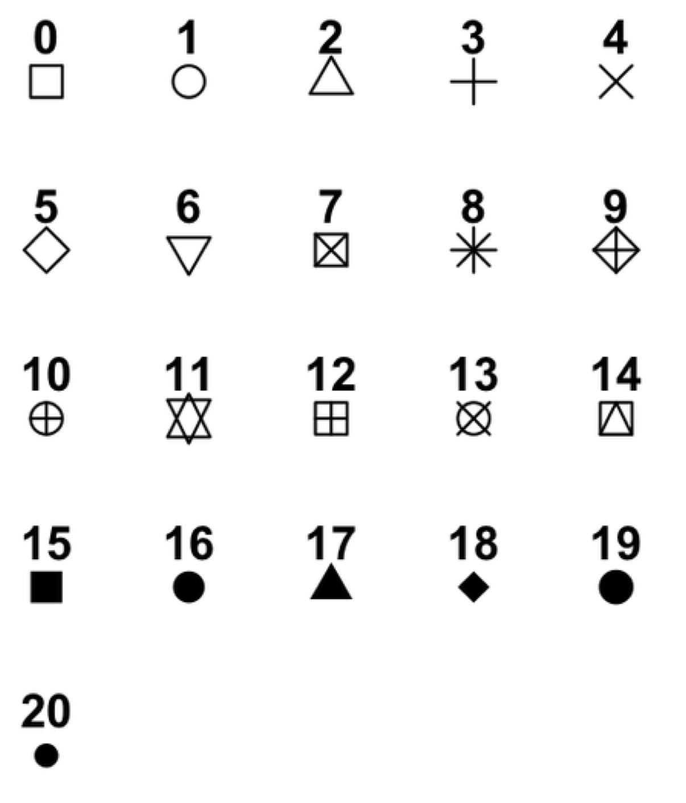

## [Introduction to RStudio](https://cfgauss.github.io/r-novice-gapminder/02-rstudio-intro/)

> ## Challenge 1
>
> Which of the following are valid R variable names?
>
> ~~~
> min_height
> max.height
> _age
> .mass
> MaxLength
> min-length
> 2widths
> celsius2kelvin
> ~~~
> {: .r}
{: .challenge}

> ## Challenge 2
>
> What will be the value of each  variable  after each
> statement in the following program?
>
>
> ~~~
> mass <- 47.5
> age <- 122
> mass <- mass * 2.3
> age <- age - 20
> ~~~
> {: .r}
{: .challenge}

> ## Challenge 3
>
> Run the code from the previous challenge, and write a command to
> compare mass to age. Is mass larger than age?
{: .challenge}

## [Seeking Help](https://cfgauss.github.io/r-novice-gapminder/03-seeking-help/)

> ## Challenge 1
>
> Look at the help for the `c` function. What kind of vector do you
> expect you will create if you evaluate the following:
>
> ~~~
> c(1, 2, 3)
> c('d', 'e', 'f')
> c(1, 2, 'f')`
> ~~~
> {: .r}
{: .challenge}

> ## Challenge 2
>
> Look at the help for the `paste` function. You'll need to use this later.
> What is the difference between the `sep` and `collapse` arguments?
{: .challenge}

> ## Challenge 3
> Use help to find a function (and its associated parameters) that you could
> use to load data from a csv file in which columns are delimited with "\t"
> (tab) and the decimal point is a "." (period). This check for decimal
> separator is important, especially if you are working with international
> colleagues, because different countries have different conventions for the
> decimal point (i.e. comma vs period).
> hint: use `??csv` to lookup csv related functions.
{: .challenge}

## [Data Structures](https://carriebrown.github.io/r-novice-gapminder/03-data-structures/)

> ## Challenge 1
>
> Predict what will happen if we perform an operation between two vectors of different size?
>
> Test your guess by creating two vectors of different lengths using the colon operator
> and adding or multiplying them together.
{: .challenge}

> ## Challenge 2
>
> What happens when we create a vector that combines data types?
>
> Try creating a vector named `my_vector` containing the elements 1, "four", and TRUE. What does the vector
> look like?
>
> Use the `str` command to determine what data type is in your vector?
{: .challenge}

> ## Challenge 3
>
> R also vectorizes functions on character vectors as well.
>
> Use the `c` function to create a character vector named `colors` with the values: "red",
> "yellow" and "blue". Use the `paste` function to combine `"My ball is"` with each element
> of your vector.
{: .challenge}

## [Subsetting Data](https://cfgauss.github.io/r-novice-gapminder/03-data-subsetting/)

> ## Challenge 1
>
> Given the following code:
>
>
> ~~~
> x <- c(5.4, 6.2, 7.1, 4.8, 7.5)
> names(x) <- c('a', 'b', 'c', 'd', 'e')
> print(x)
> ~~~
> {: .r}
>
>
>
> ~~~
>   a   b   c   d   e
> 5.4 6.2 7.1 4.8 7.5
> ~~~
> {: .output}
>
> Come up with at least 2 different commands that will produce the following output:
>
>
> ~~~
>   b   c   d
> 6.2 7.1 4.8
> ~~~
> {: .output}
>
> After you find 2 different commands, compare notes with your neighbour. Did you have different strategies?
{: .challenge}
> ## Challenge 2
>
> Run the following code to define vector `x` as above:
>
>
> ~~~
> x <- c(5.4, 6.2, 7.1, 4.8, 7.5)
> names(x) <- c('a', 'b', 'c', 'd', 'e')
> print(x)
> ~~~
> {: .r}
>
>
>
> ~~~
>   a   b   c   d   e
> 5.4 6.2 7.1 4.8 7.5
> ~~~
> {: .output}
>
> Given this vector `x`, what would you expect the following to do?
>
>~~~
> x[-which(names(x) == "c")]
>~~~
>{: .r}
>
> Test out your guess by trying out this command. Did this match your expectation?
> Why did we get this result? (Tip: test out each function in the order it's applied—this is a useful debugging strategy.)
{: .challenge}

> ## Challenge 3
>
> While it is not recommended, it is possible for multiple elements in a
> vector to have the same name. Consider this example:
>
>
>~~~
> y <- 1:3
> y
>~~~
>{: .r}
>
>
>
>~~~
>[1] 1 2 3
>~~~
>{: .output}
>
>
>
>~~~
> names(y) <- c('a', 'a', 'a')
> y
>~~~
>{: .r}
>
>
>
>~~~
>a a a
>1 2 3
>~~~
>{: .output}
>
>
> Using named subsetting can you come up with a command that will return only
> one of the `'a'` values and a different command
> that will return all of the `'a'` values? Does your answer differ from your neighbors?
{: .challenge}

> ## Challenge 4
>
> Given the following code:
>
>
> ~~~
> x <- c(5.4, 6.2, 7.1, 4.8, 7.5)
> names(x) <- c('a', 'b', 'c', 'd', 'e')
> print(x)
> ~~~
> {: .r}
>
>
>
> ~~~
>   a   b   c   d   e
> 5.4 6.2 7.1 4.8 7.5
> ~~~
> {: .output}
>
> Write a subsetting command to return the values in x that are greater than 4 and less than 7.
{: .challenge}

## [Exploring Data Frames](https://cfgauss.github.io/r-novice-gapminder/07-data-frames/)

> ## Challenge 1
>
> There are several subtly different ways to call variables, observations and
> elements from data.frames:
>
> - `cats[1]`
> - `cats$coat`
> - `cats`["coat"]
> - `cats[1, 1]`
> - `cats[, 1]`
> - `cats[1, ]`
>
> Try out these examples and explain what is returned by each one.
{: .challenge}

> ## Challenge 2
>
> Remember that you can create a new data.frame right from within R with the following syntax:
>
> ~~~
> variable1 <- c('a', 'b', 'c')
> variable2 <- c(1, 2, 3)
> variable3 <- c(TRUE, TRUE, FALSE)
> df <- data.frame(variable1,
>                  variable2,
>                  variable3,
>                  stringsAsFactors = FALSE)
> ~~~
> {: .r}
>
> Note that the `stringsAsFactors` setting allows us to tell R that we want to preserve our
> character fields and not have R convert them to factors.
>
> Modifying the syntax above, make a data.frame that holds the following information for yourself:
>
> - first name
> - last name
> - lucky number
>
> Then use `rbind` to add an entry for the people sitting beside you.
> Finally, use `cbind` to add a column with each person's answer to the question, "Is it time for coffee break?"
{: .challenge}

> ## Challenge 3
>
> Fix each of the following common data frame subsetting errors:
>
> 1. Extract observations collected for the year 1957.
>    ~~~
>    gapminder[gapminder$year = 1957,]
>    ~~~
>    {: .r}
>
> 2. Extract all columns except 1 through 4.
>
>
>    ~~~
>    gapminder[,-1:4]
>    ~~~
>    {: .r}
>
> 3. Extract the rows where the life expectancy is longer than 80 years.
>
>
>    ~~~
>    gapminder[gapminder$lifeExp > 80]
>    ~~~
>    {: .r}
>
> 4. Extract the first row, and the fourth and fifth columns
>   (`lifeExp` and `gdpPercap`).
>
>
>    ~~~
>    gapminder[1, 4, 5]
>    ~~~
>    {: .r}
>
> 5. Advanced: extract rows that contain information for the years 2002
>    and 2007.
>
>
>    ~~~
>    gapminder[gapminder$year == 2002 | 2007,]
>    ~~~
>    {: .r}
{: .challenge}

> ## Challenge 4
>
> 1. Why does `gapminder[1:20]` return an error? How does it differ from
>`gapminder[1:20, ]`?
>
>
> 2. Create a new `data.frame` called `gapminder_small` that only contains
> rows 1 through 9
> and 19 through 23. You can do this in one or two steps.
{: .challenge}

## [Control Flow](https://cfgauss.github.io/r-novice-gapminder/09-control-flow/)

> ## Challenge 1
>
> Use an `if` statement to print a suitable message
> reporting whether there are any records from 2002 in
> the `gapminder` dataset. Then write a similar statement that
> reports if there are both 2002 *and* 2012 records.
{: .challenge}

> ## Challenge 2
>
> Write a script that loops through the `gapminder` data by continent and
> prints out the continent, the mean life expectancy on that continent, and
> whether or not that life expectancy is larger than 65 years. *Hints:* If `x`
> is a numeric vector, `mean(x)` returns the mean of `x`. For any vector `x`,
> `unique(x)` returns a vector with the unique values of `x`. Finally `cat("x
> is",6)` prints `x is 6`.
{: .challenge}

> ## Challenge 3
>
> Modify the script from Challenge 4 to loop over each country. This time
> print out whether the life expectancy is smaller than 50, between 50 and 70,
> or greater than 70.
{: .challenge}

## [Dataframe Manipulation](https://cfgauss.github.io/r-novice-gapminder/10-dplyr/)

> ## Challenge 1
>
> Write a single command (which can span multiple lines and includes pipes) that
> will produce a dataframe that has the African values for `lifeExp`, `country`
> and `year`, but not for other Continents.  How many rows does your dataframe
> have and why?
{: .challenge}

> ## Challenge 2
>
> Calculate the average life expectancy per country. What is the longest average life
> expectancy and the shortest life expectancy?
{: .challenge}

> ## Challenge 3
>
> Calculate the average life expectancy in 2002
> for each continent.
{: .challenge}

> ## Challenge 4 - Advanced
>
> Modify your code from Challenge 3 to randomly select 2 countries from each continent before calculating the average life expectancy and then arrange the continent names in reverse order.
>
> **Hint:** Use the `dplyr` functions `arrange` and `sample_n`, they have
> similar syntax to other dplyr functions. Be sure to check out the help documentation for the new functions by typing `?arrange` or `?sample_n` if you run into difficulties.
{: .challenge}

## [Creating Publication Quality Graphics](https://cfgauss.github.io/r-novice-gapminder/12-plot-ggplot2/)

> ## Challenge 1
>
> Our example visualizes how the GDP per capita changes in relationship to life expectancy:
>
> ~~~
> ggplot(data = gapminder, aes(x = gdpPercap, y = lifeExp)) + geom_point()
> ~~~
> {: .r}
>
> Modify this example so that the plot visualizes how life expectancy has
> changed over time:
>
> Hint: the gapminder dataset has a column called "year", which should appear
> on the x-axis.
{: .challenge}

>
> ## Challenge 2
>
> In the previous examples and challenge we've used the `aes` function to tell
> the scatterplot **geom** about the **x** and **y** locations of each point.
> Another *aesthetic* property we can modify is the point *color*. Modify the
> code from the previous challenge to **color** the points by the "continent"
> column. What trends do you see in the data? Are they what you expected?
{: .challenge}

> ## Challenge 3
>
> Modify the color and size of the points on the point layer in the previous
> example.
>
> Hint: do not use the `aes` function, change this by adding arguments to the correct function.
{: .challenge}

> ## Challenge 4
>
> Modify your solution to Challenge 3 so that the
> points are now a different shape and are colored by continent with new
> trendlines.
>
> Hint: The color argument can be used inside the aesthetic. To change the shape of a point, use the `pch` argument. Setting `pch` to different numeric values from `1:25` yields different shapes as indicated in the chart below.
>
> 
{: .challenge}

> ## Challenge 5
>
> Create a density plot of GDP per capita, filled by continent.
>
> Advanced Challenge:
>  - Transform the x axis to better visualise the data spread.
>  - Add a facet layer to panel the density plots by year.
{: .challenge}

## [Writing Data](https://cfgauss.github.io/r-novice-gapminder/13-writing-data/)

> ## Challenge 1
>
> Rewrite your 'pdf' command to print a second
> page in the pdf, showing a facet plot
> of the same data with one panel per continent.
>
> Hint: Remember that we used the `facet_wrap` command previously to create a facet plot.
{: .challenge}

> ## Challenge 2
>
> Write a data-cleaning script file that subsets the gapminder
> data to include only data points collected since 1990.
>
> Use this script to write out the new subset to a file
> your working directory.
>
> Remember to use a different file name so that the new output doesn't overwrite your old output
{: .challenge}

## Wrapup

If you want to learn more, check out some of these great resources:

#### Help Files in R
Don't forget your R helpfiles and package vignettes which can be accessed
by using the `?` and `vignette` commands.

#### [Supplemental Lessons](https://carriebrown.github.io/r-novice-gapminder-2/)
Additional R topics that we could not cover today.

#### [RStudio cheat sheets](https://www.rstudio.com/resources/cheatsheets/)
R quick reference guides including today's handouts and more!

#### [R for Data Science](http://r4ds.had.co.nz/)
Hadley Wickham is RStudio's Chief Data Scientist and developer of the `dplyr` and `ggplot2` packages.
**R for Data Science** is his newest book, and is available here for free.

#### [One R Tip a Day on Twitter](http://twitter.com/RLangTip)
Following One R Tip a Day is a great way to learn new tips and tricks in R.

#### [Twotorials](http://www.twotorials.com/)
Twotorials is a compilation of 2 minute youtube videos which highlight a specific topic in R.

#### [Quick R Website](http://www.statmethods.net/)

#### [Cookbook for R](http://www.cookbook-r.com/)

#### [Advanced R](http://adv-r.had.co.nz/)
For more advanced topics, check out Hadley Wickham's website based on his book "Advanced R".
