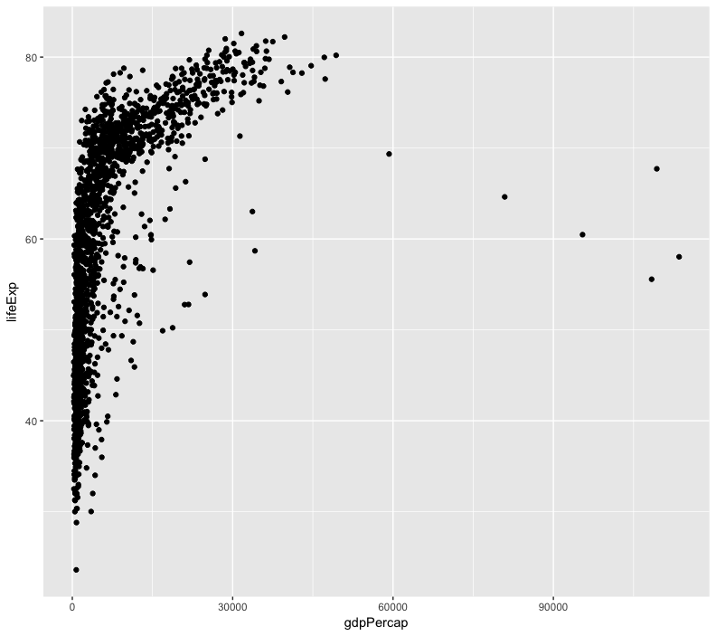
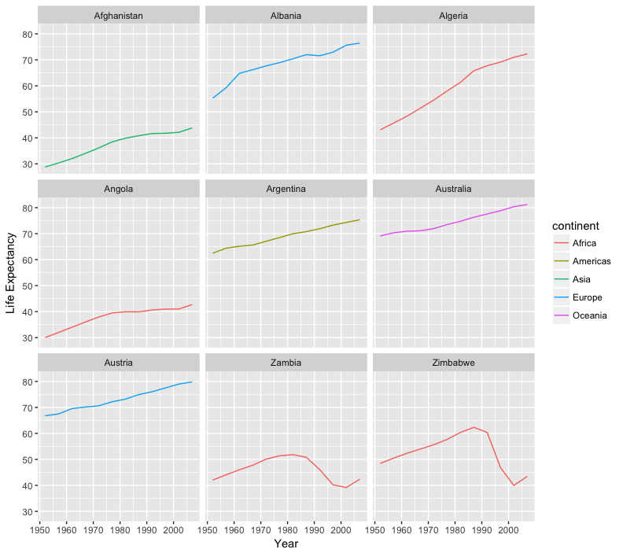
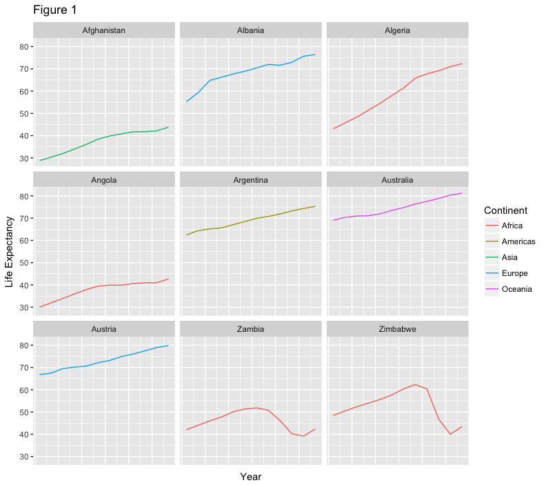

## "Introduction to R and RStudio" - 45 minutes

#### Before Starting The Workshop

Please ensure you have the latest version of R and RStudio installed on your machine.

#### Introduction to RStudio

Why R?
 - free
 - open source
 
Why RStudio?
 - provides a fully integrated environment
 - built in version control and project management
 - works on all platforms

**Basic layout**

three panels:

  * The interactive R console (entire left)
  * Environment/History (tabbed in upper right)
  * Files/Plots/Packages/Help/Viewer (tabbed in lower right)

Editor panel when you open scripts

#### Work flow within RStudio

There are two main ways one can work within RStudio.

1. Test and play within the interactive R console then copy code into
a .R file to run later.
2. Start writing in an .R file and use RStudio's command / short cut
to push current line, selected lines or modified lines to the
interactive R console.

Run button and key shortcuts

  * ctrl-enter windows/linux
  * command-enter mac
 
Project managment 

Mostly use the console

 - run code and test commands

">" cursor - similar to the shell

 - type commands
 - R executes
 - returns result
 
The simplest thing you could do with R is do arithmetic:

~~~
1 + 100
~~~
{: .r}

Ignore the [1] for now.

Incomplete commands:

~~~
> 1 +
~~~
{: .r}

Can cancel with the "Esc" key, or "Ctrl+C" in command line - can use for running code too

order of operations

~~~
3 + 5 * 2
~~~
{: .r}

Use parentheses to force order:

~~~
(3 + 5) * 2
~~~
{: .r}

Use these to make code easier to read

~~~
(3 + (5 * (2 ^ 2))) ## hard to read
3 + 5 * 2 ^ 2       ## clear, if you remember the rules
3 + 5 * (2 ^ 2)     ## if you forget some rules, this might help
~~~
{: .r}

"##" indicate comments

Scientific notation

~~~
2/10000
~~~
{: .r}

~~~
5e3  ## Note the lack of minus here
~~~
{: .r}

#### Mathematical functions

functions use name then parenthesis

~~~
sin(1)  ## trigonometry functions
~~~
{: .r}

~~~
log(1)  ## natural logarithm
~~~
{: .r}

~~~
log10(10) ## base-10 logarithm
~~~
{: .r}

~~~
exp(0.5) ## e^(1/2)
~~~
{: .r}

Can look up functions in google or use Autocomplete (tab)

#### Comparing things

~~~
1 == 1  ## equality (note two equals signs, read as "is equal to")
~~~
{: .r}

~~~
1 != 2  ## inequality (read as "is not equal to")
~~~
{: .r}

~~~
1 <  2  ## less than
~~~
{: .r}

~~~
1 <= 1  ## less than or equal to
~~~
{: .r}

~~~
1 > 0  ## greater than
~~~
{: .r}

~~~
1 >= -9 ## greater than or equal to
~~~
{: .r}

float point error, use all.equal instead of '==' for non-integers

#### Variables and assignment

use assignment arrow to save values to variables

~~~
x <- 1/40
~~~
{: .r}

No output

~~~
x
~~~
{: .r}

stored as a decimal approximation called floating point number.

point out x in environment variables

~~~
log(x)
~~~
{: .r}

Can reassign values

~~~
x <- 100
~~~
{: .r}

Can reference the variable in the assignment

~~~
x <- x + 1 ##notice how RStudio updates its description of x on the top right tab
~~~
{: .r}

The right hand side of the assignment can be any valid R expression.
The right hand side is *fully evaluated* before the assignment occurs.

character values:

~~~
y <- "green"
~~~
{: .r}

Variable names rules:
can contain letters, numbers, underscores and periods
cannot start with a number nor contain spaces at all.

Naming conventions:
  * periods.between.words
  * underscores\_between_words
  * camelCaseToSeparateWords

consistency is important

can use `=` operator for assignment:

~~~
z = 1/40
~~~
{: .r}

Less common, and sometimes it is confusing to use '=' instead of '<-'
remember consistency!

#### Functions

built in functions
coding your own
supplemental lesson

#### R Packages

* install packages: `install.packages("packagename")`
* make a package available for use: `library(packagename)`

~~~
install.packages("gapminder")
~~~
{: .r}

text scrolling for install

~~~
library(gapminder)
~~~
{: .r}

Point out how to install via the Packages tab.

Other useful commands:

* You can see what packages are installed by typing
  `installed.packages()`
* You can update installed packages by typing `update.packages()`
* You can remove a package with `remove.packages("packagename")`

**CHALLENGES** (allot 15 min)

## "Seeking Help" - 20 minutes

#### Reading Help files

~~~
help(function_name)
?function_name
~~~
{: .r}

Each help page is broken down into sections:

 - Description: An extended description of what the function does.
 - Usage: The arguments of the function and their default values.
 - Arguments: An explanation of the data each argument is expecting.
 - Details: Any important details to be aware of.
 - Value: The data the function returns.
 - See Also: Any related functions you might find useful.
 - Examples: Some examples for how to use the function.

Some may have different sections, but these are the main ones.

Help files make it easier to use R because you don;'t have to remember the usage of every function.

#### Special Operators

To seek help on special operators, use quotes:

~~~
?"+"
~~~
{: .r}

#### Getting help on packages

Many packages come with "vignettes": tutorials and extended example documentation.
Without any arguments

`vignette()` will list all vignettes for all installed packages;

`vignette(package="package-name")` will list all available vignettes for `package-name`

 and `vignette("vignette-name")` will open the specified vignette.

If a package doesn't have any vignettes, you can usually find help by typing
`help("package-name")`.

#### When you kind of remember the function

fuzzy search:

~~~
??function_name
~~~
{: .r}

#### When you have no idea where to begin

CRAN Task View - show website: http://cran.at.r-project.org/web/views

#### When your code doesn't work: seeking help from your peers

Stack Overflow -  search using the `[r]` tag.

**CHALLENGES** - allot 10 min

## "Data Structures" - finish at 10 am

#### Data Types in R

Review operators:

~~~
x + z
~~~
{: .r}

Try adding two different types of data:

~~~
x + y
~~~
{: .r}

Gives error because 101 + "green" is nonsense.

5 main data types: `double`, `integer`, `complex`, `logical`, and `character`.

~~~
typeof(3.14)
~~~
{: .r}

A `double`, also referred to as a *floating point number*, is how R stores numeric values 
by default.

~~~
typeof(1L)
~~~
{: .r}

To use an `integer` value in R, we use the L to tell R that this value is an integer value. 
Without the L, R would store this value as a `double`.

~~~
typeof(1+1i)
~~~
{: .r}

R can also support `complex` values as well. Unless you are doing mathematical analyses or 
complicated transformations, chances are you will not encounter this data type very often.

~~~
typeof(TRUE)
~~~
{: .r}

~~~
[1] "logical"
~~~
{: .output}

`Logical` data types are particularly helpful in subsetting data frames and other types of data manipulation. We will explore this concept more later.

~~~
typeof('banana')
~~~
{: .r}

~~~
[1] "character"
~~~
{: .output}

Lastly, R stores strings as the `character` type.

No matter how complicated our analyses become, all data in R is interpreted as one of these
basic data types.

#### Vectors

Remember the [1]?
R never uses just a single value, but instead uses vectors. Output before was a vector of 
length 1.

As seen in the challenges, we can build vectors using the `c` function.

~~~
x <- c(2, 4, 6, 8, 10, 12, 14, 16)
x
~~~
{: .r}

**colon operator** quickly creates sequential vectors:

~~~
y <- 1:8
y
~~~
{: .r}

can specify whatever start and stop point we want

~~~
-4:7
~~~
{: .r}

~~~
[1] -4 -3 -2 -1  0  1  2  3  4  5  6  7
~~~
{: .output}

R is **vectorized**
operations on the entire vector - returns a vector

~~~
y + 10
~~~
{: .r}

~~~
[1] 11 12 13 14 15 16 17 18
~~~
{: .output}

~~~
x * 2
~~~
{: .r}

~~~
[1]  4  8 12 16 20 24 28 32
~~~
{: .output}

~~~
x + y
~~~
{: .r}

~~~
[1]  3  6  9 12 15 18 21 24
~~~
{: .output}

when operating on two or more vectors, R performs the operation element by element:

~~~
x:  2  4  6  8 10 12 14 16
    +  +  +  +  +  +  +  +
y:  1  2  3  4  5  6  7  8
--------------------------
    3  6  9 12 15 18 21 24
~~~
{: .r}

**CHALLENGES** - allot 10 minutes

Vectors can be made up of any of the basic data types.

Character Vectors:

~~
a <- c("one", "two", "three", "four")
a
~~~
{: .r}

similar to `typeof`, `str` will tell us the data type.

also will give us a compact view of some basic information about our object.

~~~
str(a)
~~~
{: .r}

*chr* that this is a *character* vector
numbers in the brackets indicates the dimensions of our vector. 
then a list the first few elements 

Logical Vectors:

~~~
b <- c(TRUE, TRUE, FALSE, TRUE)
b
~~~
{: .r}

***CHALLENGES***

we can use `c` to add elements to an existing vector

~~~
c(x, 20, 25)
~~~
{: .r}

Changes won't be saved until we use the assignment arrow

modify `y` to contain all numbers to 20 by adding on to the existing vector

~~~
y <- c(y, 9:20)
y
~~~
{: .r}

This is a nested operation, from Order of Opers. earlier the sequence inside the parenthesis is created first, then added to `y`

`length` can quickly return the length of a vector.

~~~
length(y)
~~~
{: .r}

Other data structures, **lists** and **matrices**
use `?list()`, `?matrix()` or supplemental lesson to learn about them.

primarily **data frames** today, continued after break:

## COFFEE BREAK - 15 min

## Subsetting Data - 45 minutes

*** HERE ***

R's power comes from it's vectorization. 
many powerful subset operators that will allow you to
easily perform complex operations on any kind of dataset without the resource depletion of loops.

Let's start with a data structure we've seen before, the workhorse of R: atomic vectors.

~~~
x <- c(5.4, 6.2, 7.1, 4.8, 7.5)
~~~
{: .r}

can name elements within our vectors using the `names` function.

~~~
names(x) <- c('a', 'b', 'c', 'd', 'e')
x
~~~
{: .r}

how do we get to individual contents?

#### Accessing elements using their indices

we can give their corresponding index, starting from one:

~~~
x[1]
~~~
{: .r}

~~~
x[4]
~~~
{: .r}

the square brackets operator is a function
For atomic vectors (and matrices), it means "get me the nth element".

We can ask for multiple elements at once:

~~~
x[c(1, 3)]
~~~
{: .r}

Or slices of the vector:

~~~
x[1:4]
~~~
{: .r}

the `:` operator lets us select a range of elements

We can ask for the same element multiple times:

~~~
x[c(1,1,3)]
~~~
{: .r}

a number outside of the vector, R will return missing values

~~~
x[6]
~~~
{: .r}

This is a vector of length one containing an `NA`, whose name is also `NA`.

If we ask for the 0th element, we get an empty vector:

~~~
x[0]
~~~
{: .r}

~~~
named numeric(0)
~~~
{: .output}

R starts indices with 1 instead of 0 like other programming languages such as C and python

#### Skipping and removing elements

use a negative number to return every element *except* for the one specified:

~~~
x[-2]
~~~
{: .r}

We can skip multiple elements:

~~~
x[c(-1, -5)]  ## or x[-c(1,5)]
~~~
{: .r}

Combining positive and negative indices will return an error.

To make the subset permanent we need to assign the value.

~~~
x <- x[-4]
x
~~~
{: .r}

***CHALLENGES*** - allot 5 minutes

#### Subsetting by name

can extract elements by using their name

~~~
x[c("a", "c")]
~~~
{: .r}

more reliable since positions can change. But we cannot as easily skip or remove by name.

To skip (or remove) a single named element:

~~~
x[-which(names(x) == "a")]
~~~
{: .r}

The `which` function returns the indices of all `TRUE` elements of its argument.
Step by step analysis of command:

~~~
names(x) == "a"
~~~
{: .r}

The condition operator is applied to every name of the vector `x`. Only the
first name is "a" so that element is TRUE.

`which` then converts this to an index:

~~~
which(names(x) == "a")
~~~
{: .r}

Only the first element is `TRUE`, so `which` returns 1. 

the '-' makes this index negative and removes the element

Skipping multiple named indices is similar, but uses a different comparison
operator:

~~~
x[-which(names(x) %in% c("a", "c"))]
~~~
{: .r}

`%in%` goes through each element of its left argument, in this case the
names of `x`, and asks, "Does this element occur in the second argument?".

***CHALLENGES*** - allot 5 min

why can't we use `==` like before? Good question.

~~~
names(x) == c('a', 'c')
~~~
{: .r}

**gives a warning**

`==` works by comparing each element of its left argument
to the corresponding element of its right argument.

Here's a mock illustration:

~~~
c("a", "b", "c", "d", "e")  ## names of x
   |    |    |    |    |    ## The elements == is comparing
c("a", "c")
~~~
{: .r}

when one vector is shorter than the other, it gets *recycled*:

~~~
c("a", "b", "c", "d", "e")  ## names of x
   |    |    |    |    |    ## The elements == is comparing
c("a", "c", "a", "c", "a")
~~~
{: .r}

R repeats `c("a", "c")` two and a half times. If the longer
vector length isn't a multiple of the shorter vector length, then
R will also print out a warning message.

This difference between `==` and `%in%` is important to remember,
because it can introduce hard to find and subtle bugs!

#### Using Logical Operations to Subset Data

We can subset data by using boolean vectors:

~~~
x[c(TRUE, TRUE, FALSE, FALSE, FALSE)]
~~~
{: .r}

R will return any values that are indicated by `TRUE` in your vector, and filter out any that 
are `FALSE`.

~~~
x[c(TRUE, FALSE)]
~~~
{: .r}

R also recycled our logical vector

comparison operators evaluate to logical vectors
we can use them to succinctly subset vectors

~~~
x > 7
~~~
{: .r}

nest our comparison inside of our subsetting operators to tell R to return a subset

~~~
x[x > 7]
~~~
{: .r}

#### Combining logical conditions

  * `&`, the "logical AND" operator: returns `TRUE` if both the left and right
    are `TRUE`.
  * `|`, the "logical OR" operator: returns `TRUE`, if either the left or right
    (or both) are `TRUE`.

The recycling rule applies with both of these

`&&` and `||` do not use the recycling rule: they only look at the first element of each
 vector and ignore the remaining elements. Usually used in programming not data analysis

  * `!`, the "logical NOT" operator: converts `TRUE` to `FALSE` and `FALSE` to
`TRUE`. can negate a single logical condition, or a whole vector of conditions

the `all` function returns `TRUE` if every element of the vector is `TRUE`
the `any` function returns `TRUE` if one or more elements of the vector are `TRUE`.

***CHALLENGES*** allot 10 min

## "Exploring Data Frames" - done at noon

#### Data Frames

so far data structures contained all of the same data type
one of R's most powerful features is its ability to deal with tabular data (like spreadsheet or CSV)
**Data Frames** are built from vectors but can contain vectors of different data types.

build a data frame from existing vectors - `data.frame()` command

~~~
coat <- c("calico", "black", "tabby")
weight <- c(2.1, 5.0, 3.2)
likes_string <- c(1,0,1)

cats <- data.frame(coat, weight, likes_string)
cats
~~~
{: .r}

can pull out columns by specifying them using the `$` operator

~~~
cats$weight
~~~
{: .r}

~~~
cats$coat
~~~
{: .r}

can perform operations on columns within our data frame, just like with vectors

~~~
#### Say we discovered that the scale weighs two Kg light:
cats$weight + 2
~~~
{: .r}

~~~
paste("My cat is", cats$coat)
~~~
{: .r}

***CHALLENGES*** allot 5 min

add an additional column for age using `c`

~~~
age <- c(2,3,5,12)
cats
~~~
{: .r}

We can then add this as a column in our data frame by using the `cbind()` function:

~~~
cats <- cbind(cats, age)
~~~
{: .r}

Error - there are more elements in age but only 3 rows in cats.

~~~
age <- c(4,5,8)
cats <- cbind(cats, age)
cats
~~~
{: .r}

add a row, rows are lists since they contain different types of elements:

~~~
newRow <- list("tortoiseshell", 3.3, TRUE, 9)
cats <- rbind(cats, newRow)
~~~
{: .r}

Our list had the correct number of elements, so why did R give us a warning?

~~~
class(cats$coat)
~~~
{: .r}

Factors are data classes that R uses to handle categorical data. categories are called **levels**
Anything new that doesn't fit into one of its categories is rejected as nonsense and 
is replaced by an `NA` until we explicitly add that as a *level* in the factor:

~~~
levels(cats$coat)
~~~
{: .r}

~~~
levels(cats$coat) <- c(levels(cats$coat), 'tortoiseshell')
cats <- rbind(cats, list("tortoiseshell", 3.3, TRUE, 9))
~~~
{: .r}

can also change the column to character to prevent this

~~~
str(cats)
~~~
{: .r}

~~~
cats$coat <- as.character(cats$coat)
str(cats)
~~~
{: .r}

We can now add rows and columns, but we've accidentally added a garbage row:

~~~
cats
~~~
{: .r}

~~~
           coat weight likes_string age
1        calico    2.1            1   4
2         black    5.0            0   5
3         tabby    3.2            1   8
4          <NA>    3.3            1   9
5 tortoiseshell    3.3            1   9
~~~
{: .output}

We can ask for a data.frame minus this offending row:

~~~
cats[-4,]
~~~
{: .r}

Notice the comma with nothing after it to indicate we want to drop the entire fourth row.

using `na.omit` allows us to drop all rows with `NA` values:

~~~
na.omit(cats)
~~~
{: .r}

Let's reassign the output to `cats`, so that our changes will be permanent:

~~~
cats <- na.omit(cats)
~~~
{: .r}

remember that *columns are vectors or factors, and rows are lists.* 

We can also glue two dataframes together with `rbind`:

~~~
cats <- rbind(cats, cats)
cats
~~~
{: .r}

But now the row names are unnecessarily complicated. We can remove the rownames,
and R will automatically re-name them sequentially:

~~~
rownames(cats) <- NULL
cats
~~~
{: .r}

***CHALLENGES*** - allot 5 min

let's use a more realistic dataset
the `gapminder` data set built into the `gapminder` package.

install the `gapminder` package if you havent already

~~~
install.packages("gapminder")
~~~
{: .r}

load it now using the `library` command (explain how to use the `packages` tab

~~~
library('gapminder')
~~~
{: .r}

to make our analysis reproducible, we should put the code into a script file

mention loading libraries in script files

investigate the data - check
out what the data looks like with `str`:

~~~
str(gapminder)
~~~
{: .r}

We can also examine individual columns of the data.frame with our `typeof` function:

~~~
typeof(gapminder$year)
~~~
{: .r}

~~~
typeof(gapminder$lifeExp)
~~~
{: .r}

~~~
typeof(gapminder$country)
~~~
{: .r}

~~~
str(gapminder$country)
~~~
{: .r}

information about its dimensions;
remembering that `str(gapminder)` said there were 1704 observations of 6
variables in gapminder
what do you think the following will produce, and why?

~~~
length(gapminder)
~~~
{: .r}

try it, point out that data frames are **lists** of vectors

~~~
typeof(gapminder)
~~~
{: .r}

`length` gave us 6 because gapminder is built out of a list of 6
columns
To get the number of rows and columns in our dataset, try:

~~~
nrow(gapminder)
~~~
{: .r}

~~~
ncol(gapminder)
~~~
{: .r}

Or, both at once:

~~~
dim(gapminder)
~~~
{: .r}

titles of all the columns:

~~~
colnames(gapminder)
~~~
{: .r}

ask ourselves if the structure R is reporting matches our intuition or expectations
do the basic data types reported for each column make sense? No? We need to fix it now

Once we're happy that the data types and structures seem reasonable start digging into our data proper

~~~
head(gapminder)
~~~
{: .r}

***CHALLENGES*** - 5 min

###### Subsetting Data Frames

data frames are lists of vectors, so selecting a single element returns a single vector, or column of the data frame.

~~~
head(gapminder[5])
~~~
{: .r}

the `c` command to returns multiple columns:

~~~
head(gapminder[c(1,5)])
~~~
{: .r}

`$` provides a convenient shorthand to extract columns by name:

~~~
head(gapminder$year)
~~~
{: .r}

With two arguments, `[` subsets on typical matrix format
if one of the arguments is blank, R will 
default to include all of the rows or columns:

~~~
gapminder[1:3,]
~~~
{: .r}

If we subset a single row, the result will be a data frame

~~~
gapminder[3,]
~~~
{: .r}

But for a single column the result will be a vector.

***CHALLENGES*** - 10 min

## "Lunch" - 1 hour

## Control Flow - 35 minutes

Often when we're coding we want to control the flow of our actions. This can be done
by setting actions to occur only if a condition or a set of conditions are met.
Alternatively, we can also set an action to occur a particular number of times.

There are several ways you can control flow in R.
For conditional statements, the most commonly used approaches:

~~~
## if
if (condition is true) {
  perform action
}

## if ... else
if (condition is true) {
  perform action
} else {  ## that is, if the condition is false,
  perform alternative action
}
~~~
{: .r}

if we want R to print a message if a variable `x` has a particular value:

~~~
## sample a random number from a Poisson distribution
## with a mean (lambda) of 8

x <- rpois(1, lambda=8)

if (x >= 10) {
  print("x is greater than or equal to 10")
}

x
~~~
{: .r}

you may not get the same output as your neighbour

Let's set a seed so that we all generate the same 'pseudo-random' number

~~~
set.seed(10)
x <- rpois(1, lambda=8)

if (x >= 10) {
  print("x is greater than or equal to 10")
} else if (x > 5) {
  print("x is greater than 5")
} else {
  print("x is less than 5")
}
~~~
{: .r}

 In the above case, the function `rpois()` generates a random number following a
 Poisson distribution with a mean (i.e. lambda) of 8. The function `set.seed()`
 guarantees that all machines will generate the exact same 'pseudo-random'
 number 
 
when R evaluates the condition inside `if()` statements, it is
looking for a logical element

This can cause some
headaches for beginners. 
~~~
x  <-  4 == 3
if (x) {
  "4 equals 3"
}
~~~
{: .r}

As we can see, the message was not printed because the vector x is `FALSE`

~~~
x <- 4 == 3
x
~~~
{: .r}

***CHALLENGES*** - 5 min

Did anyone get a warning message like this?

~~~
Warning in if (gapminder$year == 2012) {: the condition has length > 1 and
only the first element will be used
~~~
{: .error}

If your condition evaluates to a vector with more than one logical element,
the function `if()` will still run, but will only evaluate the condition in the first
element. Here you need to make sure your condition is of length 1.

 The `any()` function will return TRUE if at least one
 TRUE value is found within a vector, otherwise it will return `FALSE`.
 This can be used in a similar way to the `%in%` operator.
 The function `all()`, as the name suggests, will only return `TRUE` if all values in
 the vector are `TRUE`.

#### Repeating operations

If you want to iterate over
a set of values a `for()` loop will do the job.

This is the most
flexible of looping operations, but therefore also the hardest to use
correctly. 
Avoid using `for()` loops unless the the calculation at each iteration depends on the results of previous iterations.

The basic structure of a `for()` loop is:

~~~
for(iterator in set of values){
  do a thing
}
~~~
{: .r}

For example:

~~~
for(i in 1:10){
  print(i)
}
~~~
{: .r}

The `1:10` bit creates a vector on the fly; you can iterate
over any other vector as well.

We can use a `for()` loop nested within another `for()` loop to iterate over two things at
once.

~~~
for(i in 1:5){
  for(j in c('a', 'b', 'c', 'd', 'e')){
    print(paste(i,j))
  }
}
~~~
{: .r}

Rather than printing the results, we could write the loop output to a new object.

~~~
output_vector <- c()
for(i in 1:5){
  for(j in c('a', 'b', 'c', 'd', 'e')){
    temp_output <- paste(i, j)
    output_vector <- c(output_vector, temp_output)
  }
}
output_vector
~~~
{: .r}

This approach can be useful, but 'growing your results' is computationally inefficient, so avoid
it when you are iterating through a lot of values.

A better way is to define your (empty) output object before filling in the values.

~~~
output_matrix <- matrix(nrow=5, ncol=5)
j_vector <- c('a', 'b', 'c', 'd', 'e')
for(i in 1:5){
  for(j in 1:5){
    temp_j_value <- j_vector[j]
    temp_output <- paste(i, temp_j_value)
    output_matrix[i, j] <- temp_output
  }
}
output_vector2 <- as.vector(output_matrix)
output_vector2
~~~
{: .r}

#### While loops

to repeat an operation until a certain condition is met use a `while()` loop

~~~
while(this condition is true){
  do a thing
}
~~~
{: .r}

here's a while loop
that generates random numbers from a uniform distribution (the `runif` function)
between 0 and 1 until it gets one that's less than 0.1.

~~~
z <- 1
while(z > 0.1){
  z <- runif(1)
  print(z)
}
~~~
{: .r}

You have to be careful
that you don't end up in an infinite loop because your condition is never met.

***CHALLENGES*** - 15 min

## Dataframe Manipulation with dplyr - finish by 2:30

Manipulation of dataframes means many things to many researchers, we often
select certain observations (rows) or variables (columns), we often group the
data by a certain variable(s), or we even calculate summary statistics. We can
do these operations using the normal base R operations:

~~~
mean(gapminder[gapminder$continent == "Africa", "gdpPercap"])
~~~
{: .r}

~~~
mean(gapminder[gapminder$continent == "Americas", "gdpPercap"])
~~~
{: .r}

~~~
mean(gapminder[gapminder$continent == "Asia", "gdpPercap"])
~~~
{: .r}

This can be repetitive, and repetition will cost you time, make your code bulky 
and hard to read and potentially introduce some nasty bugs

#### The `dplyr` package

the `dplyr` package provides a number of useful functions for manipulating dataframes
in a way that will reduce the above repetition, reduce the probability of making
errors, and probably even save you some typing. the `dplyr` grammar can also make your code easier to read.

we're going to cover 6 of the most commonly used functions as well as using
pipes (`%>%`) to combine them

1. `select()`
2. `filter()`
3. `group_by()`
4. `summarize()`
5. `mutate()`

If you have have not installed this package earlier, please do so:

~~~
install.packages('dplyr')
~~~
{: .r}

Now let's load the package:

~~~
library(dplyr)
~~~
{: .r}

#### Using select()

If we wanted to use only a few of the variables in
our dataframe we could use the `select()` function.

~~~
year_country_gdp <- select(gapminder,year,country,gdpPercap)
~~~
{: .r}

look at `year_country_gdp` 
see that it only contains the year, country and gdpPercap. 
we used 'normal' grammar
but the strengths of `dplyr` lie in combining several functions using pipes. Since the pipes grammar
is unlike anything we've seen in R before, let's repeat what we've done above
using pipes.

~~~
year_country_gdp <- gapminder %>% select(year,country,gdpPercap)
~~~
{: .r}

To help you understand why we wrote that in that way, let's walk through it step
by step
First we summon the gapminder dataframe and pass it on, using the pipe
symbol `%>%`, to the next step, which is the `select()` function. 

In R, a pipe symbol is `%>%` while in the
shell it is `|`

#### Using filter()

using the above but only with European
countries, we can combine `select` and `filter`

~~~
year_country_gdp_euro <- gapminder %>%
    filter(continent=="Europe") %>%
    select(year,country,gdpPercap)
~~~
{: .r}

first we pass the data frame to `filter` then pass the filtered dataframe to `select`.

If we reversed this, it would not work since we removed the continent data with `select`

***CHALLENGES*** - 5 min

#### Using group_by() and summarize()

If we want to do the same above for each country, we can reduce repetitiveness with `group_by`
`group_by` will essentially use every unique criteria that you
could have used in `filter`.

~~~
str(gapminder)
~~~
{: .r}

~~~
str(gapminder %>% group_by(continent))
~~~
{: .r}

notice that the structure of the dataframe where we used `group_by()`
(`grouped_df`) is not the same as the original `gapminder` (`data.frame`).

 A
`grouped_df` can be thought of as a `list` where each item in the `list`is a
`data.frame` which contains only the rows that correspond to the a particular
value.

#### Using summarize()

`group_by()` is much more
exciting in conjunction with `summarize()`

`summarize` allows us to create  new
variable(s) by using functions that repeat for each of the continent-specific
data frames

~~~
gdp_bycontinents <- gapminder %>%
    group_by(continent) %>%
    summarize(mean_gdpPercap=mean(gdpPercap))
~~~
{: .r}

That allowed us to calculate the mean gdpPercap for each continent, but it gets
even better.

***CHALLENGES*** - 5 min

`group_by()` allows us to group by multiple variables. Let's group by `year` and `continent`.

~~~
gdp_bycontinents_byyear <- gapminder %>%
    group_by(continent,year) %>%
    summarize(mean_gdpPercap=mean(gdpPercap))
~~~
{: .r}

we can define more than 1 variable with `summarize`

~~~
gdp_pop_bycontinents_byyear <- gapminder %>%
    group_by(continent,year) %>%
    summarize(mean_gdpPercap=mean(gdpPercap),
              sd_gdpPercap=sd(gdpPercap),
              mean_pop=mean(pop),
              sd_pop=sd(pop))
~~~
{: .r}

#### Using mutate()

We can create new variables prior to (or even after) summarizing information using `mutate()`.

~~~
gdp_pop_bycontinents_byyear <- gapminder %>%
    mutate(gdp_billion=gdpPercap*pop/10^9) %>%
    group_by(continent,year) %>%
    summarize(mean_gdpPercap=mean(gdpPercap),
              sd_gdpPercap=sd(gdpPercap),
              mean_pop=mean(pop),
              sd_pop=sd(pop),
              mean_gdp_billion=mean(gdp_billion),
              sd_gdp_billion=sd(gdp_billion))
~~~
{: .r}

*** ADVANCED CHALLENGE *** - can skip if running out of time.

## "Coffee Break" - 15 min

## Creating Publication-Quality Graphics - 1 hour and 15 min

Plotting our data is one of the best ways to
quickly explore it and the various relationships
between variables.

Today we'll be learning about the ggplot2 package, because
it is a bit harder to learn but produces better looking plots than the base plotting ability.

ggplot2 is built on the grammar of graphics (where the gg comes from)
the idea that any plot can be
expressed from the same set of components:
 - a **data** set
 - a **coordinate system**
 -  a set of **geoms**--the visual representation of data points.

The key to understanding ggplot2 is thinking about a figure in layers.

Let's start off with an example. The first thing we need to do is load the `ggplot2` package

~~~
library("ggplot2")
~~~
{: .r}

to begin graphing, we use the `ggplot` function
this lets R
know that we're creating a new plot, and any of the arguments we give the
`ggplot` function are the *global* options for the plot: they apply to all
layers on the plot.

~~~
library("ggplot2")
ggplot(data = gapminder, aes(x = gdpPercap, y = lifeExp)) +
  geom_point()
~~~
{: .r}

We've passed in two arguments to `ggplot`. 

First, we tell `ggplot` what data we
want to show on our figure

For the second argument we passed in the `aes` function, which
tells `ggplot` how variables in the **data** map to *aesthetic* properties of
the figure, in this case the **x** and **y** locations. 

Here we told `ggplot` we
want to plot the "gdpPercap" column of the gapminder data frame on the x-axis, and
the "lifeExp" column on the y-axis. 

we didn't need to explicitly
pass `aes` these columns (e.g. `x = gapminder[, "gdpPercap"]`)

Other options that can be set with the `aes` function include color, size, transparency and shape. We will talk more about that later.

By itself, the call to `ggplot` isn't enough to draw a figure:

~~~
ggplot(data = gapminder, aes(x = gdpPercap, y = lifeExp))
~~~
{: .r}

We need to tell `ggplot` how we want to visually represent the data, which we
do by adding a new **geom** layer. In our example, we used `geom_point`, which
tells `ggplot` we want to visually represent the relationship between **x** and
**y** as a scatterplot of points:

~~~
ggplot(data = gapminder, aes(x = gdpPercap, y = lifeExp)) +
  geom_point()
~~~
{: .r}

***CHALLENGES*** - 10 min

#### Layers

Using a scatterplot probably isn't the best for visualizing change over time.
Instead, let's tell `ggplot` to visualize the data as a line plot:

~~~
ggplot(data = gapminder, aes(x=year, y=lifeExp, by=country, color=continent)) +
  geom_line()
~~~
{: .r}

Instead of adding a `geom_point` layer, we've added a `geom_line` layer. We've
added the **by** *aesthetic*, which tells `ggplot` to draw a line for each
country.

if we want to visualize both lines and points on the plot? We can
simply add another layer to the plot:

~~~
ggplot(data = gapminder, aes(x=year, y=lifeExp, by=country, color=continent)) +
  geom_line() + geom_point()
~~~
{: .r}

note that each layer is drawn on top of the previous layer. 

~~~
ggplot(data = gapminder, aes(x=year, y=lifeExp, by=country)) +
  geom_line(aes(color=continent)) + geom_point()
~~~
{: .r}

the *aesthetic* mapping of **color** has been moved from the
global plot options in `ggplot` to the `geom_line` layer so it no longer applies
to the points.

Now we can clearly see that the points are drawn on top of the
lines.

> #### Tip: Setting an aesthetic to a value instead of a mapping
>
> So far, we've seen how to use an aesthetic (such as **color**) as a *mapping* to a variable in the data. For example, when we use `geom_line(aes(color=continent))`, ggplot will give a different color to each continent. But what if we want to change the colour of all lines to blue? You may think that `geom_line(aes(color="blue"))` should work, but it doesn't. Since we don't want to create a mapping to a specific variable, we simply move the color specification outside of the `aes()` function, like this: `geom_line(color="blue")`.
{: .callout}

***CHALLENGES*** - 5 min

#### Transformations and statistics

`ggplot` also makes it easy to overlay statistical models over the data. To
demonstrate we'll go back to our first example:

~~~
ggplot(data = gapminder, aes(x = gdpPercap, y = lifeExp)) +
  geom_point()
~~~
{: .r}

Currently it's hard to see the relationship between the points due to some strong
outliers in GDP per capita. We can change the scale of units on the x axis using
the *scale* functions. These control the mapping between the data values and
visual values of an aesthetic. We can also modify the transparency of the
points, using the *alpha* function, which is especially helpful when you have
a large amount of data which is very clustered.

~~~
ggplot(data = gapminder, aes(x = gdpPercap, y = lifeExp)) +
  geom_point(alpha = 0.5) + scale_x_log10()
~~~
{: .r}

The `log10` function applied a transformation to the values of the gdpPercap
column before rendering them on the plot, so that each multiple of 10 now only
corresponds to an increase in 1 on the transformed scale, e.g. a GDP per capita
of 1,000 is now 3 on the y axis, a value of 10,000 corresponds to 4 on the y
axis and so on. This makes it easier to visualize the spread of data on the
x-axis.

> #### Tip Reminder: Setting an aesthetic to a value instead of a mapping
>
> Notice that we used `geom_point(alpha = 0.5)`. As the previous tip mentioned, using a setting outside of the `aes()` function will cause this value to be used for all points, which is what we want in this case. But just like any other aesthetic setting, *alpha* can also be mapped to a variable in the data. For example, we can give a different transparency to each continent with `geom_point(aes(alpha = continent))`.
{: .callout}

We can fit a simple relationship to the data by adding another layer,
`geom_smooth`:

~~~
ggplot(data = gapminder, aes(x = gdpPercap, y = lifeExp)) +
  geom_point() + scale_x_log10() + geom_smooth(method="lm")
~~~
{: .r}

We can make the line thicker by *setting* the **size** aesthetic in the
`geom_smooth` layer:

~~~
ggplot(data = gapminder, aes(x = gdpPercap, y = lifeExp)) +
  geom_point() + scale_x_log10() + geom_smooth(method="lm", size=1.5)
~~~
{: .r}

There are two ways an *aesthetic* can be specified. Here we *set* the **size**
aesthetic by passing it as an argument to `geom_smooth`. Previously in the
lesson we've used the `aes` function to define a *mapping* between data
variables and their visual representation.

***CHALLENGES*** - 10 min

#### Multi-panel figures

we can split this out over multiple panels
by adding a layer of **facet** panels. Focusing only on those countries with
names that start with the letter "A" or "Z".

start by subsetting the data

use the `substr` function to
pull out a part of a character string

the `%in%` operator allows us to make multiple comparisons rather
than write out long subsetting conditions 

~~~
starts.with <- substr(gapminder$country, start = 1, stop = 1)
az.countries <- gapminder[starts.with %in% c("A", "Z"), ]
ggplot(data = az.countries, aes(x = year, y = lifeExp, color=continent)) +
  geom_line() + facet_wrap( ~ country)
~~~
{: .r}

The `facet_wrap` layer takes a **formula** as its argument, denoted by the tilde
(~). This tells R to draw a panel for each unique value in the country column
of the gapminder dataset.

#### Modifying text

change some of the text
elements. 

rename our `x` and `y` axes using the `xlab()` and `ylab()` functions:

~~~
ggplot(data = az.countries, aes(x = year, y = lifeExp, color=continent)) +
  geom_line() + facet_wrap( ~ country) +
  xlab("Year") + ylab("Life Expectancy")
~~~
{: .r}

 
give our figure a title with the `ggtitle()` function. And capitalize the label of our
legend. This can be done using the **scales** layer.

~~~
ggplot(data = az.countries, aes(x = year, y = lifeExp, color=continent)) +
  geom_line() + facet_wrap( ~ country) +
  xlab("Year") + ylab("Life Expectancy") + 
  ggtitle("Figure 1") + scale_colour_discrete(name="Continent")
~~~
{: .r}

 
let's remove the x-axis labels so the plot is less cluttered. 
To do this, we use the **theme** layer which controls
the axis text and overall text size.

~~~
ggplot(data = az.countries, aes(x = year, y = lifeExp, color=continent)) +
  geom_line() + facet_wrap( ~ country) +
  xlab("Year") + ylab("Life Expectancy") + 
  ggtitle("Figure 1") + scale_colour_discrete(name="Continent") +
  theme(axis.text.x=element_blank(), axis.ticks.x=element_blank())
~~~
{: .r}

mention that line breaks can be anywhere, but you need to have the + at the end of the line.

***CHALLENGES*** - allot 5 min

## Writing Data - complete by 4:20 pm

#### Saving plots

So making publication quality plots is great but does us little good if we cannot get them out of
R and into our documents.

You can save a plot from within RStudio using the 'Export' button
in the 'Plot' window

if you are working in a command line environment, or want to create multiple plots without user interaction?

you can use the `ggsave` function to save your plots quickly. This function can be used to save the last displayed plot in a format specified by the file name.

You can save as several different formats, such as a PDF:

~~~
ggsave("My_most_recent_plot.pdf")
~~~
{: .r}

Or as a JPG:

~~~
ggsave("My_most_recent_plot.jpg")
~~~
{: .r}

`ggsave` also allows you to specify size and quality of the image. You can check out all of the 
options using the `?ggsave` command to view the help file.

if you will want to save plots without creating them in the
'Plot' window first. Perhaps you want to make a pdf document with
multiple pages: each one a different plot, for example. Or perhaps
you're looping through multiple subsets of a file, plotting data from
each subset, and you want to save each plot, but obviously can't stop
the loop to click 'Export' for each one.

The function
`pdf` creates a new pdf device. You can control the size and resolution
using the arguments to this function.

~~~
pdf("Life_Exp_vs_time.pdf", width=12, height=4)
ggplot(data=gapminder, aes(x=year, y=lifeExp, color=continent)) +
  geom_point()

dev.off()
~~~
{: .r}

The `pdf` command opens the pdf file, and any output between this command and the `dev.off()` command 
will be added to that file. 

dont forget the `dev.off` command

Open up this document and have a look.

***CHALLENGES*** - 5 min

The commands `jpeg`, `png` etc. are used similarly to produce
documents in different formats.

#### Writing data

At some point, you'll also want to write out data from R.

We can use the `write.table` function for this, which is
very similar to the `read.table` function that we mentioned previously in Lesson 2. 

Let's create a data-cleaning script, for this analysis, we
only want to focus on the gapminder data for Australia:

~~~
aust_subset <- gapminder[gapminder$country == "Australia",]

write.table(aust_subset,
  file="gapminder-aus.csv",
  sep=","
)
~~~
{: .r}

 **in line comments** and linebreaks within function calls

~~~
aust_subset <- gapminder[gapminder$country == "Australia",]

write.table(aust_subset,		## Gapminder data for countries located in Australia
  file="gapminder-aus.csv", 	## Name of the output file
  sep=","						## Comma separated
)
~~~
{: .r}

open a shell window and navigate to the location of the file using your `cd` command. 
to find out where R is saving
your files, you can check the `file` pane or use the `getwd()` command.

~~~
head gapminder-aus.csv
~~~
{: .r}

you can view
the file in R by clicking on the filename in the `file` pane and selecting `View File`.

Where did all these
quotation marks come from? Also the row numbers are
meaningless. let's look at the help file

~~~
?write.table
~~~
{: .r}

By default R will wrap character vectors with quotation marks
when writing out to file. It will also write out the row and
column names.

~~~
write.table(aust_subset,		## Gapminder data for countries located in Australia
  file="gapminder-aus.csv",		## Name of the output file
  sep=",",						## Comma separated
  quote=FALSE,					## Turn off quotation marks
  row.names=FALSE				## No row names
)
~~~
{: .r}

look at the data again using our shell skills:

~~~
head gapminder-aus.csv
~~~
{: .r}

That looks better!

***CHALLENGES*** - 5 min

## Wrap Up - 5 min

#### Help Files in R
Don't forget your R helpfiles and package vignettes which can be accessed
by using the `?` and `vignette` commands.

#### [Supplemental Lessons](https://carriebrown.github.io/r-novice-gapminder-2/)
Additional R topics that we could not cover today.

### R Club at UNL
The R Club meets on East Campus twice a month. It is headed by Leonardo Bastos, a PhD student in Agronomy
and Horticulture. You can [email](mailto: lmbastos@unl.edu) Leonardo for more information, or check out
the club's [GitHub page](https://github.com/ahgsa-unl) which contains previous meeting topics.

## [RStudio cheat sheets](https://www.rstudio.com/resources/cheatsheets/)
R quick reference guides including today's handouts and more!

### [R for Data Science](http://r4ds.had.co.nz/)
Hadley Wickham is RStudio's Chief Data Scientist and developer of the `dplyr` and `ggplot2` packages.
R for Data Science is his newest book, and is available here for free.

### [One R Tip a Day on Twitter](https://twitter.com/RLangTip)
Following One R Tip a Day is a great way to learn new tips and tricks in R.

### [Twotorials](http://www.twotorials.com/)
Twotorials is a compilation of 2 minute youtube videos which highlight a specific topic in R.

### [Quick R Website](http://www.statmethods.net/)

### [Cookbook for R](http://www.cookbook-r.com/)

### [Advanced R](http://adv-r.had.co.nz/)
For more advanced topics, check out Hadley Wickham's website based on his book "Advanced R".

Remind them to fill out post-it survey